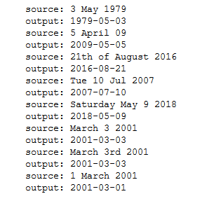

### Readme- Neural Machine Translation

#### Brief Description-
- Here our model translates any form of human readable dates into machine readable dates (YYYY-MM-DD) using attention model. We have trained our model on a dataset of 10000 human readable dates and their equivalent machine-readable ones.

#### Methods Used-
- Attention Model
- LSTM

#### Technologies Used-
- Python
- Keras
- Numpy
- Matplotlib
- Babel
- Faker

#### Getting Started-
- Just clone the entire repo and run the Jupyter Notebook.

#### Output-
- 
- [Rest the output can be seen in Jupyter Notebook](https://github.com/gadia-aayush/Neural-Machine-Translation/blob/master/neural-machine-translation-with-attention.ipynb).
